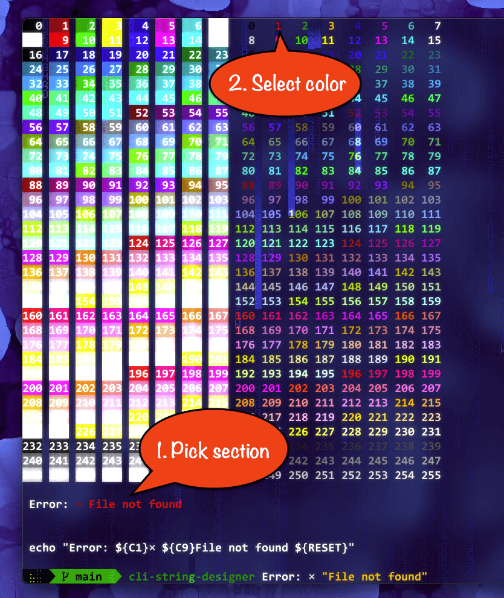

# Quick and easy way to build colored terminal strings.

Sick of restarting your terminal every time you change a color code? 

So was I.

Now I use this instead. 

NerdFont / Unicode support.



## Installation:
#### Prerequisites:
- Go language compiler:
```bash
brew install go # if on mac
```
- Any terminal with at least 256-color support

#### Build from source:
```bash
git clone https://github.com/martinkruusement/cli-string-designer.git
cd cli-string-designer
go install
go build
```


## Usage:
```bash
cli-string-designer Error: ⨯ "File not found"
```

This creates a color picker with 3 independently colorable sections:
- Error:
- ⨯
- File not found
> Use quotes to create a section with multiple words

#### Now you simply click on a section and pick a color for it.
And maybe a background color.

## Color variables:
#### The default color variables are included in: [./colors.sh](./colors.sh)
- To use them: `source './wherever-install-dir/cli-string-designer/colors.sh'` in your .zshrc.
- It contains all 512 color codes for foregrounds and backgrounds, plus 3 resets, so it may increase your terminal startup time slightly or moderately, depending on your system.

- You don't need it, but then you'll need to replace `${C2}` with `\033[38;5;002m` and `${RESET}` with `\033[0m` etc.


## How to exit: 
Any of those will work:
- <kbd>esc</kbd>
- <kbd>enter</kbd>
- <kbd>ctrl+c</kbd>

In the end you'll get an `echo` sample you can paste wherever you need it:
```bash
echo "${C9}Error: ${C15}⨯ ${C243}File not found ${RESET}"
```
